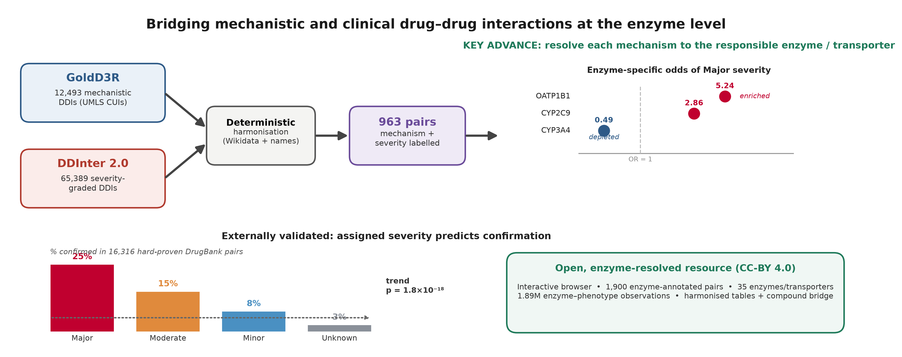
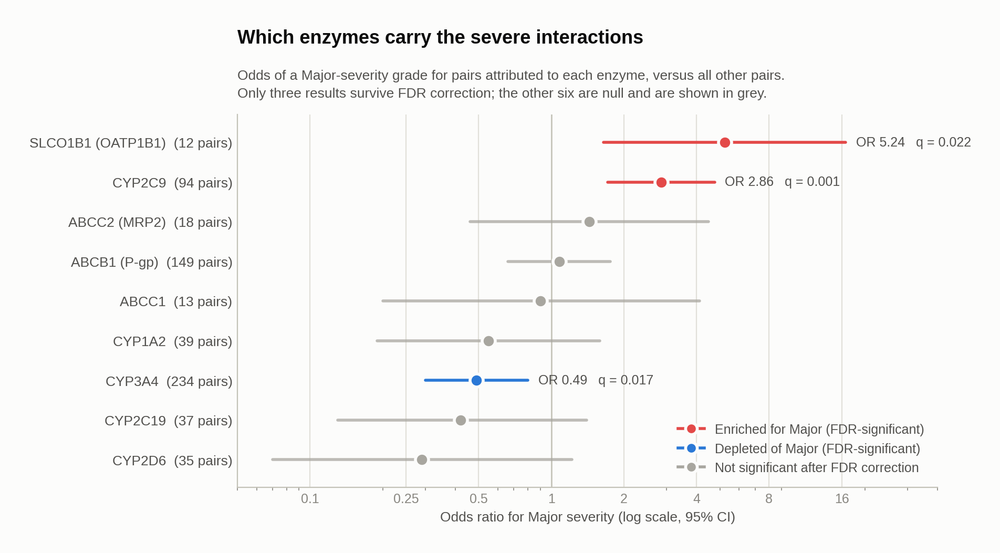
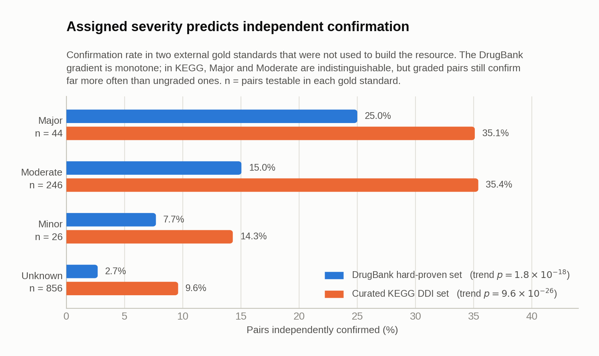
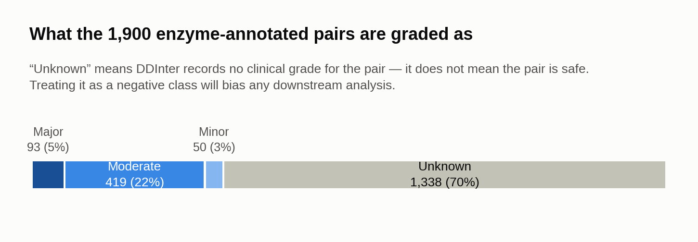
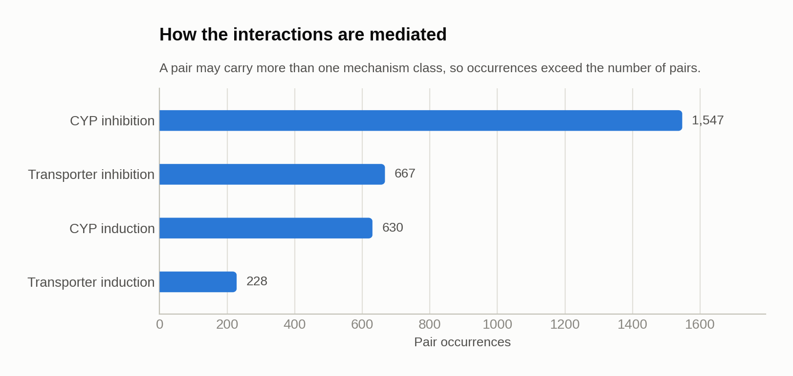
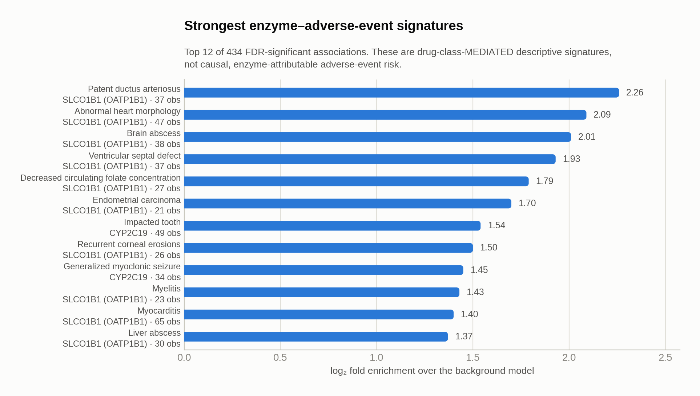
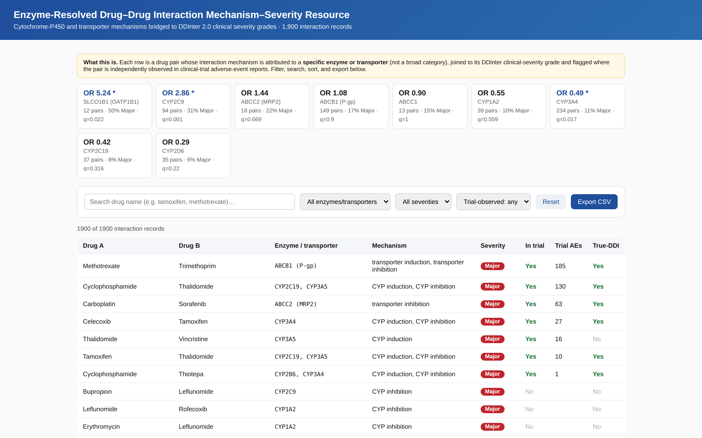

# An enzyme-resolved dataset linking drug-interaction mechanisms to clinical severity grades

[](https://creativecommons.org/licenses/by/4.0/)
[](data/)
[](data/ddi_enzyme_database.csv)
[](data/enzyme_severity_stats.csv)
[](validate.py)

Complete data record for the manuscript *"An enzyme-resolved dataset linking
drug interaction mechanisms to clinical severity grades"* (submitted to
*Scientific Data*). Everything a reader, reviewer or reuser needs is here: all
17 data tables, a machine-readable data dictionary, generated figures, worked
examples, and a self-contained interactive browser.

> **Data availability.** All files are in this public repository. **No
> registration, login, licence request, fee or embargo applies** — anyone can
> download everything anonymously and immediately, either from this page or with
> `git clone https://github.com/adeebnoor/ddi-enzyme-severity-resource.git`.
> Released under CC BY 4.0.

> **Cite this dataset**
>
> Noor, A. *An enzyme-resolved dataset linking drug interaction mechanisms to
> clinical severity grades.* Submitted to *Scientific Data* (2026).
> Dataset: https://github.com/adeebnoor/ddi-enzyme-severity-resource
>
> BibTeX, APA and other formats are generated automatically from
> [`CITATION.cff`](CITATION.cff) — use the **"Cite this repository"** button in
> the sidebar. ORCID [0000-0002-8251-1853](https://orcid.org/0000-0002-8251-1853).



---

## Contents

- [What this resource is](#what-this-resource-is)
- [What it shows](#what-it-shows)
- [The interactive browser](#the-interactive-browser)
- [Repository layout](#repository-layout)
- [File inventory](#file-inventory)
- [How to use it](#how-to-use-it)
- [Verifying the record](#verifying-the-record)
- [Scope, caveats and known limitations](#scope-caveats-and-known-limitations)
- [Provenance of source data](#provenance-of-source-data)
- [Licence and citation](#licence-and-citation)

---

## What this resource is

Mechanistic drug–drug interaction (DDI) catalogues tell you **how** two drugs
interact. Clinical catalogues tell you **how badly**. The two vocabularies have
historically not been joined, so a pharmacologist asking "which enzyme is
carrying the clinically severe interactions?" has had no dataset to ask it of.

This resource harmonises a mechanistic DDI corpus (GoldD3R, D3-derived,
UMLS CUI-indexed) with a severity-graded clinical corpus (DDInter 2.0), and —
the step that makes it useful — resolves each surviving interaction to the
**specific cytochrome P450 enzyme or membrane transporter responsible for it**.

The result is a pair-level table where mechanism, responsible enzyme and
clinical severity grade sit on the same row, plus per-enzyme association
statistics and four independent external validations: the DrugBank hard-proven
set, the manually curated KEGG DDI set, clinical-trial adverse-event reports,
and the trueDDI gold set.

**In one line:** 1,900 enzyme-annotated drug pairs, 240 drugs, 35 enzymes and
transporters, four external validations, one interactive browser, everything
open.

---

## What it shows

Every figure below is generated directly from the CSV files in `data/` by
[`scripts/make_figures.py`](scripts/make_figures.py) — nothing is hand-drawn, so
the figures cannot drift from the data. Full commentary on each is in
[`figures/FIGURES.md`](figures/FIGURES.md); PNG and SVG versions of all of them
are in [`figures/`](figures/).

### The headline result: CYP3A4 is not where the danger is



CYP3A4 handles more interactions than any other enzyme in the resource (234
pairs) and is usually treated as the main driver of clinical DDI risk. It is in
fact **depleted** of Major-severity interactions (OR 0.49, *q* = 0.017). The
enzymes that are enriched are **SLCO1B1 (OATP1B1)** (OR 5.24, *q* = 0.022) and
**CYP2C9** (OR 2.86, *q* = 0.001) — a transporter and a comparatively
low-traffic CYP.

Six of the nine enzymes do not survive FDR correction. They are shown in grey
and should be read as null results, not as trends. The SLCO1B1 estimate rests
on 12 pairs and its confidence interval runs from 1.65 to 16.64 — and it is
sensitive to a labelling artefact: the same transporter also appears under a
bare `SLCO1B1` label, and merging the two gives OR 3.92 (1.33–11.57),
*p* = 0.018. The direction survives, the magnitude does not. See
[limitations](#scope-caveats-and-known-limitations).

### The severity labels hold up against curators who never saw them



Severity grades inherited through harmonisation are only worth anything if they
predict something external. They do, in two gold standards that were not used
to build the resource. The DrugBank gradient is monotone across all four levels
(trend *p* = 1.8 × 10⁻¹⁸). In KEGG, Major and Moderate are effectively
indistinguishable (35.1% vs 35.4%) — an honest limitation — but graded pairs
still confirm far more often than ungraded ones (OR 4.82).

### Most pairs have no clinical grade at all



70% of pairs are `Unknown`: DDInter records no clinical grade for them. This is
a statement about **coverage**, not about safety, and it is the single most
important thing to understand before reusing the data. Treating `Unknown` as a
negative class will bias any model trained on it.

### Two more views

| | |
|---|---|
|  |  |
| Inhibition dominates induction; CYP-mediated dominates transporter-mediated. A pair may carry several classes. | The strongest of 434 FDR-significant enzyme × adverse-event signatures. **Drug-class-mediated and descriptive — not causal.** |

---

## The interactive browser



[`docs/index.html`](docs/index.html) is a **single self-contained HTML file**:
all data and code are embedded, there are no external scripts, stylesheets, CDN
calls or network requests of any kind. It works offline, from a USB stick, or
behind an air-gapped firewall.

Search by drug name; filter by enzyme/transporter, severity grade and
trial-observation status; sort any column; export the current filtered view to
CSV.

| How to open | What to do |
| --- | --- |
| **Locally — always works** | Download the repository and double-click `docs/index.html`. Any modern browser. |
| **Live on the web** | <https://adeebnoor.github.io/ddi-enzyme-severity-resource/> — enable once under Settings → Pages → Source: `main` / `/docs`. |
| **Without Pages** | <https://htmlpreview.github.io/?https://github.com/adeebnoor/ddi-enzyme-severity-resource/blob/main/docs/index.html> |

---

## Repository layout

```
.
├── README.md                     this file — data descriptor and file inventory
├── README.ar.md                  ملخص بالعربية
├── LICENSE                       CC BY 4.0
├── CITATION.cff                  machine-readable citation metadata
├── CHECKSUMS.sha256              SHA-256 for every released file
├── validate.py                   re-derives all 219 documented figures from the data
├── data/                         17 CSV tables + DATA_DICTIONARY.md
├── docs/
│   └── index.html                self-contained interactive browser
├── figures/                      generated PNG + SVG, and FIGURES.md
├── tables/                       Tables 1-8 as CSV + a formatted workbook
├── scripts/
│   └── make_figures.py           regenerates every figure from data/
└── examples/
    ├── quickstart.py             six worked recipes
    └── README.md                 what each recipe demonstrates
```

---

## File inventory

All files are UTF-8, comma-separated, with a single header row. Row counts
exclude the header and were computed from the released files.
Column-by-column definitions are in
[`data/DATA_DICTIONARY.md`](data/DATA_DICTIONARY.md).

### Primary table

| File | Rows | Description |
| --- | ---: | --- |
| [`data/ddi_enzyme_database.csv`](data/ddi_enzyme_database.csv) | 1,900 | **The primary resource.** One row per drug pair: responsible enzyme(s)/transporter(s), mechanism class(es), DDInter clinical severity grade, external-validation flags. |

Columns: `drug_A`, `drug_B` (cleaned display names) · `enzymes`
(comma-separated gene symbols) · `mechanism` (one or more of *CYP inhibition*,
*CYP induction*, *transporter inhibition*, *transporter induction*) ·
`severity` (`Major` / `Moderate` / `Minor` / `Unknown`) · `in_trial`
(`Yes`/`No`) · `trial_AEs` (count of trial adverse-event reports) ·
`in_trueDDI` (`Yes`/`No`).

At a glance: **240 distinct drugs**, **35 distinct enzymes and transporters**,
**562 pairs carrying a graded severity** (93 Major, 419 Moderate, 50 Minor) and
1,338 `Unknown`. Mechanism-class occurrences: CYP inhibition 1,547, transporter
inhibition 667, CYP induction 630, transporter induction 228. 79 pairs appear
in the clinical-trial DDI set, 229 in the trueDDI gold set.

### Pair × enzyme tables

| File | Rows | Description |
| --- | ---: | --- |
| [`data/enzyme_pair_severity.csv`](data/enzyme_pair_severity.csv) | 3,072 | Long format: one row per pair × enzyme × direction. Columns `CID_A`, `drug_A`, `CID_B`, `drug_B`, `enzyme_gene`, `uniprot`, `direction` (`inhibition` / `induction` for CYP-mediated, `transporter_inhibition` / `transporter_induction` for transporter-mediated), `severity`. |
| [`data/enzyme_pair_drugbank_flagged.csv`](data/enzyme_pair_drugbank_flagged.csv) | 1,799 | The same pair table with DrugBank accessions (`DB_A`, `DB_B`) and a per-row `drugbank_hard_proven` flag. Covers 1,172 unique pairs. |

### Statistics

| File | Rows | Description |
| --- | ---: | --- |
| [`data/enzyme_severity_stats.csv`](data/enzyme_severity_stats.csv) | 9 | Per-enzyme association with Major severity for the nine enzymes with **≥10 non-`Unknown`, inhibition-direction pairs**: `n_pairs`, `n_major`, `pct_major`, odds ratio with 95% CI, raw *p*, FDR *q*, E-value, direction of effect. |
| [`data/enzyme_phenotype_enrichment.csv`](data/enzyme_phenotype_enrichment.csv) | 434 | FDR-significant enzyme × adverse-event (HPO term) associations across 7 enzymes and 338 distinct HPO terms. |

| Enzyme / transporter | Pairs | % Major | OR (95% CI) | FDR *q* | E-value |
| --- | ---: | ---: | --- | ---: | ---: |
| SLCO1B1 (OATP1B1) | 12 | 50.0 | **5.24 (1.65–16.64)** | 0.022 | 9.96 |
| CYP2C9 | 94 | 30.9 | **2.86 (1.71–4.76)** | 0.001 | 5.16 |
| ABCC2 (MRP2) | 18 | 22.2 | 1.44 (0.46–4.48) | 0.669 | — |
| ABCB1 (P-gp) | 149 | 16.8 | 1.08 (0.66–1.76) | 0.900 | — |
| ABCC1 | 13 | 15.4 | 0.90 (0.20–4.13) | 1.000 | — |
| CYP1A2 | 39 | 10.3 | 0.55 (0.19–1.59) | 0.559 | — |
| CYP3A4 | 234 | 10.7 | **0.49 (0.30–0.80)** | 0.017 | 3.48 |
| CYP2C19 | 37 | 8.1 | 0.42 (0.13–1.40) | 0.316 | — |
| CYP2D6 | 35 | 5.7 | 0.29 (0.07–1.22) | 0.220 | — |

Bold = survives FDR correction. The other six rows are null results.

### External validation

| File | Rows | Description |
| --- | ---: | --- |
| [`data/drugbank_validation.csv`](data/drugbank_validation.csv) | 73 | Pairs independently confirmed in the DrugBank hard-proven set. |
| [`data/drugbank_validation_summary.csv`](data/drugbank_validation_summary.csv) | 8 | 1,172 pairs DrugBank-mapped, 73 hard-proven confirmed (11 Major, 37 Moderate, 2 Minor, 23 Unknown); 72 Micromedex pairs mapped, 35 in the intersection. Confirmation by grade: Major 25.0%, Moderate 15.0%, Minor 7.7%, Unknown 2.7% (trend *p* = 1.8 × 10⁻¹⁸). |
| [`data/kegg_ddi_validation.csv`](data/kegg_ddi_validation.csv) | 1,243 | Testable pairs against the curated KEGG DDI set. `kegg_flag` is documented as CI = contraindication / P = precaution, but **all 204 flagged rows are `P`** — no contraindication-level pair survives the mapping, so the KEGG check rests entirely on precaution-level pairs. |
| [`data/kegg_enzyme_concordance.csv`](data/kegg_enzyme_concordance.csv) | 86 | Per-drug comparison of our enzyme attribution against KEGG METABOLISM annotation. 86.0% agreement. |
| [`data/kegg_validation_summary.csv`](data/kegg_validation_summary.csv) | 13 | 228 drugs mapped, 3,034 KEGG DDI pairs, 1,243 testable. Major 35.1%, Moderate 35.4%, Minor 14.3%, Unknown 9.6% (*z* = 10.49, *p* = 9.6 × 10⁻²⁶); graded-vs-Unknown OR 4.82. |
| [`data/trial_validation.csv`](data/trial_validation.csv) | 79 | Enzyme-annotated pairs observed in clinical-trial adverse-event reports. **41 of the 79 carry a graded severity** (7 Major, 29 Moderate, 5 Minor); the remaining 38 are `Unknown`. |
| [`data/trial_validation_summary.csv`](data/trial_validation_summary.csv) | 8 | 20,618 enzyme pairs total, 545 (2.6%) in the trial DDI set, 4,233 (20.5%) in trueDDI. **Caveat:** the metric labelled `graded_and_in_trials = 79` counts *all* trial-observed pairs, not only graded ones — 41 are graded. The 20,618-pair superset is not part of this deposit. |
| [`data/liddi_coverage_comparison.csv`](data/liddi_coverage_comparison.csv) | 7 | Overlap with the independent LIDDI corpus: 4,070 LIDDI pairs vs 12,493 GoldD3R pairs, 169 shared drugs, **0 shared interaction pairs** — LIDDI is entirely complementary. |

### Manuscript tables

[`tables/`](tables/) holds Tables 1–8 of the Data Descriptor as UTF-8 CSV, plus
`SupplementaryTables.xlsx` with one sheet per table. Tables 4, 6, 7 and 8 are
recomputable from `data/` and are asserted by `validate.py`; Tables 1, 2, 3 and 5
derive from intermediate tables upstream of this deposit and are included so the
published values can be read and cited without transcription. See
[`tables/README.md`](tables/README.md).

### Identifier bridges and linkage layers

| File | Rows | Description |
| --- | ---: | --- |
| [`data/cid_severity_bridge.csv`](data/cid_severity_bridge.csv) | 448 | PubChem CID ↔ DDInter ID bridge with the authoritative cleaned `display_name`. |
| [`data/cid_drugbank_crosswalk.csv`](data/cid_drugbank_crosswalk.csv) | 255 | PubChem CID → DrugBank accession mapping used for the DrugBank validation. |
| [`data/ddinter2_mechanism_annotations.csv`](data/ddinter2_mechanism_annotations.csv) | 11,298 | DDInter 2.0 mechanism layer: identifiers, severity, seven binary PK/PD mechanism flags, free-text `mechanism_text`. **Every one of the 11,298 rows is `Major`** — this is a Major-only slice, not a general DDInter export. Documentation and linkage only. |
| [`data/mimic_coprescription_examples.csv`](data/mimic_coprescription_examples.csv) | 13 | Illustrative real-world co-prescriptions from the MIMIC-IV demo cohort (100 patients). |

---

## How to use it

```bash
git clone https://github.com/adeebnoor/ddi-enzyme-severity-resource.git
cd ddi-enzyme-severity-resource
python3 examples/quickstart.py     # six worked recipes, needs pandas
```

```python
import pandas as pd

ddi = pd.read_csv("data/ddi_enzyme_database.csv")

# All Major-severity pairs mediated by CYP2C9
ddi[(ddi.severity == "Major") & ddi.enzymes.str.contains("CYP2C9")]

# Long format, one row per pair x enzyme x direction — best for joins
pairs = pd.read_csv("data/enzyme_pair_severity.csv")
pairs.groupby(["enzyme_gene", "severity"]).size().unstack(fill_value=0)

# Only the rows suitable for supervised learning
graded = ddi[ddi.severity != "Unknown"]        # 562 pairs
```

**Join keys.** Use `CID_pubchem` or DrugBank accessions for machine linkage.
Drug names are cleaned display names and are stable within this resource, but
`cid_severity_bridge.csv` is the authoritative name source — use it rather than
string-matching across files.

See [`examples/README.md`](examples/README.md) for what each worked recipe
demonstrates.

---

## Verifying the record

Two commands reproduce every claim made in this documentation:

```bash
sha256sum -c CHECKSUMS.sha256   # file integrity — 46 files
python3 validate.py             # every documented figure, re-derived
```

`validate.py` uses only the Python standard library. It re-derives all **219**
figures quoted in this README and in `data/DATA_DICTIONARY.md` — row counts,
severity distributions, drug and enzyme counts, every odds ratio and confidence
interval, all validation-summary values — directly from the CSV files. It also
asserts cross-file invariants:

- the pair × enzyme `direction` counts reconcile exactly with the primary
  table's mechanism-class counts;
- E-values are populated for exactly the FDR-significant enzymes and no others;
- the DrugBank confirmation gradient (25.0 / 15.0 / 7.7 / 2.7%) is recomputable
  from the released pair table, not merely asserted in a summary file;
- the bridge's populated `display_name` set is exactly the primary table's
  240-drug set;
- no CSV has ragged rows;
- and every data-quality caveat listed below is asserted, so a reader can
  confirm the limitations are real and still hold (the trial-file severity
  breakdown, the Major-only DDInter layer, the absent KEGG contraindication
  flag, the two SLCO1B1 accessions, the 32 raw PubChem titles, the 26
  target-only attributions).

It exits non-zero on any mismatch. Figures can be regenerated the same way:

```bash
python3 scripts/make_figures.py
```

---

## Scope, caveats and known limitations

Stated plainly so that reusers do not over-read the resource.

**About the severity grades**

- **`Unknown` is not `no interaction`.** 1,338 of 1,900 pairs (70%) carry
  `severity = Unknown`, meaning DDInter records no clinical grade — not that
  the pair is safe. Analyses treating `Unknown` as a negative class will be
  biased.
- **The KEGG gradient is not monotone.** Major (35.1%) and Moderate (35.4%)
  confirm at indistinguishable rates. The graded-vs-ungraded separation is
  robust; the Major-vs-Moderate ordering is not supported by KEGG, only by
  DrugBank.

**About the statistics**

- **Small strata.** The SLCO1B1 result rests on 12 pairs (6 Major); its CI runs
  1.65–16.64. Six of the nine enzymes do not survive FDR correction and are
  null results.
- **The comparator arm is not fully specified.** Recomputing
  `enzyme_severity_stats.csv` from `enzyme_pair_severity.csv` (unique
  non-`Unknown` pairs, inhibition direction, index enzyme vs all other
  enzyme-attributed pairs) reproduces `n_pairs` and `n_major` exactly for all
  nine enzymes, and reproduces the odds ratio, confidence interval and *p*-value
  exactly for six of them. Three — CYP3A4, ABCB1 and CYP2C9, the three enzymes
  with the most multi-enzyme overlap — differ by up to about 10% (CYP3A4 0.443
  vs 0.49; ABCB1 1.00 vs 1.08; CYP2C9 2.78 vs 2.86). Direction, significance and
  every conclusion are unchanged, but how a pair attributed to several enzymes
  is treated in the comparator arm needs to be stated before the numbers are
  exactly reproducible.
- **Enzyme–phenotype fingerprints are descriptive, not causal.** The
  associations in `enzyme_phenotype_enrichment.csv` are mediated by drug class
  and must not be read as enzyme-attributable adverse-event risk. The released
  file contains the 434 FDR-significant associations only, not the full
  underlying observation set.

**About identifiers and naming**

- **`SLCO1B1` appears under two labels with two different UniProt accessions,
  and this affects the headline result.** `SLCO1B1 (OATP1B1)` (accession
  `Q4U2R8`, 18 rows) and bare `SLCO1B1` (accession `Q9Y6L6`, the reviewed
  SwissProt entry, 2 rows) denote the same transporter. Only the first was
  carried into `enzyme_severity_stats.csv`. Merging the two labels changes the
  SLCO1B1 estimate from *n* = 12, 50.0% Major, OR 5.24 (1.65–16.64),
  *p* = 0.0075 to *n* = 14, 42.9% Major, **OR 3.92 (1.33–11.57), *p* = 0.018**.
  The direction and nominal significance survive; the magnitude does not.
  Because the two labels carry different accessions, the `uniprot` column
  cannot be used to normalise them automatically.
- **One further label (`SLCO1B3? (OATP)`) retains an upstream uncertainty
  marker.** Normalise gene symbols before aggregating.
- **`enzyme_pair_severity.csv` does not carry cleaned display names.** 32 of its
  240 drug names are raw PubChem systematic titles
  (`Azane;cyclobutane-1,1-dicarboxylic acid;platinum` for carboplatin,
  `(E,Z)-Tamoxifen`, `Methotrexate, (A+-)-`). Join the long-format tables on
  `CID_pubchem`, never on names — a name join silently drops 13% of drugs.
- **A few display names are brand names, not INNs.** `Arthrotec`, `Anzemet` and
  `Respules` reach the primary table as PubChem compound titles. `Arthrotec` is
  a *combination* product (diclofenac + misoprostol), which is a meaningful
  wrinkle in a pair-level DDI resource — treat those rows with care.
- **16 PubChem CIDs map to more than one DDInter ID.** The bridge keeps all of
  them semicolon-separated rather than picking one arbitrarily; downstream
  joins should decide explicitly how to handle the one-to-many case.
- **`display_name` is populated only for the 240 drugs that reach the primary
  table.** The other 208 bridge rows are candidate compounds retained for
  provenance and leave it blank — including 73 rows marked
  `joined_to_ddinter = yes`. Filter on a non-empty `display_name` when you want
  the drugs actually used.

**About what the enzyme attribution means**

- **A small number of pairs are attributed to a shared pharmacodynamic target
  rather than to a metabolising enzyme or transporter.** 26 of 1,900 pairs
  (1.4%) rest solely on such an attribution — `PTGS2` (COX-2) for
  celecoxib + ketorolac, `CYP19A1` for anastrozole + letrozole (both aromatase
  inhibitors, so the shared target is not a pharmacokinetic mechanism),
  `HPRT1` for azathioprine + 6-mercaptopurine. Two of the 26 are graded Major.
- **A few "interactions" are prodrug–metabolite pairs.** 5-fluorouracil +
  capecitabine is attributed to CYP2C9 and carries the largest trial
  adverse-event count in the file (465), but capecitabine is a prodrug of
  5-fluorouracil; azathioprine + 6-mercaptopurine is the same situation. These
  co-occurrences are real in the source data but are not drug–drug interactions
  in the mechanistic sense, and should be excluded from benchmark sets.

**About the supplementary layers**

- **The DDInter 2.0 mechanism layer is a Major-only slice.** All 11,298 rows
  carry `severity = Major`. It is provided for documentation and identifier
  linkage and carries no analytical claim; do not compute severity
  distributions or mechanism frequencies from it.
- **The 20,618-pair enzyme-attribution superset is not deposited.** The rates
  quoted in `trial_validation_summary.csv` (2.6% trial, 20.5% trueDDI) are
  computed over that superset. Within this deposit the corresponding rates are
  79/1,900 = 4.2% and 229/1,900 = 12.1%; the two are not comparable.
- **MIMIC-IV co-prescriptions are illustrative.** 13 rows from a 100-patient
  demo cohort; they demonstrate real-world co-occurrence and support no
  prevalence estimate.
- **Micromedex is commercial** and is therefore represented only as mapped
  counts in the validation summary (72 pairs mapped, 35 in the hard-proven
  intersection), never as redistributed content.

**About the resource as a whole**

- This is a **research resource, not a clinical decision-support tool.** It must
  not be used as a sole basis for prescribing decisions.

---

## Provenance of source data

| Source | Role | Identifier |
| --- | --- | --- |
| GoldD3R (D3-derived) | Mechanistic DDI corpus, UMLS CUI-indexed |https://doi.org/10.1093/jamia/ocz061 |
| DDInter 2.0 | Clinical severity grades and mechanism layer | [doi:10.1093/nar/gkae726](https://doi.org/10.1093/nar/gkae726) |
| PubChem | Compound identifiers and titles | [doi:10.1093/nar/gkac956](https://doi.org/10.1093/nar/gkac956) |
| UniProt | Enzyme/transporter protein accessions | [doi:10.1093/nar/gkac1052](https://doi.org/10.1093/nar/gkac1052) |
| Human Phenotype Ontology | Adverse-event vocabulary | [doi:10.1093/nar/gkaa1043](https://doi.org/10.1093/nar/gkaa1043) |
| DrugBank 5.0 | Independent validation (hard-proven set) | [doi:10.1093/nar/gkx1037](https://doi.org/10.1093/nar/gkx1037) |
| KEGG DRUG | Independent validation (curated DDI set) | Kanehisa *et al.* |
| MIMIC-IV demo | Illustrative co-prescription | [doi:10.13026/dp1f-ex47](https://doi.org/10.13026/dp1f-ex47) |
| LIDDI | Coverage comparison | [doi:10.1007/978-3-319-25010-6_18](https://doi.org/10.1007/978-3-319-25010-6_18) |
| Micromedex (Merative) | Commercial cross-check — counts only | not redistributed |

Redistribution here is limited to derived, harmonised tables. Where a source
licence does not permit redistribution, only aggregate counts are reported.

---

## Licence and citation

All data files, documentation, figures and the interactive browser are released
under the [Creative Commons Attribution 4.0 International licence
(CC BY 4.0)](https://creativecommons.org/licenses/by/4.0/). You may share and
adapt the material for any purpose, including commercially, provided you give
appropriate credit. Source datasets remain under their own terms — see the
provenance table.

Machine-readable citation metadata is in [`CITATION.cff`](CITATION.cff). Until
the article is published, please cite:

> Noor, A. *An enzyme-resolved dataset linking drug interaction mechanisms to
> clinical severity grades.* Submitted to *Scientific Data* (2026).
> Data: <https://github.com/adeebnoor/ddi-enzyme-severity-resource>

## Contact

Adeeb Noor — questions and corrections via the
[issue tracker](https://github.com/adeebnoor/ddi-enzyme-severity-resource/issues).
