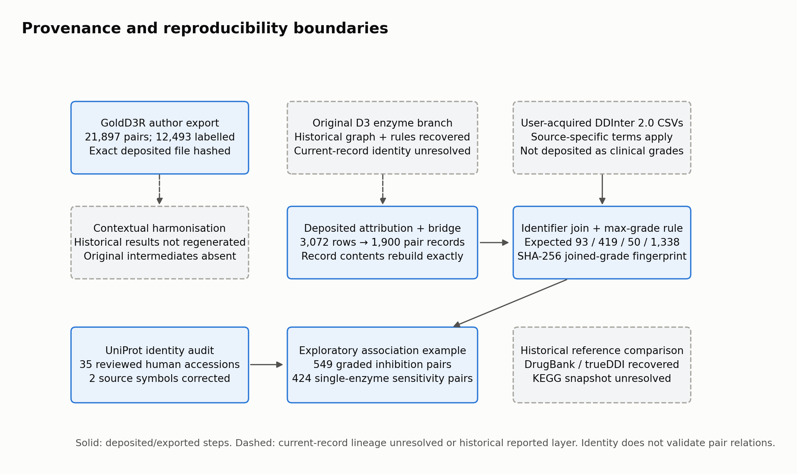
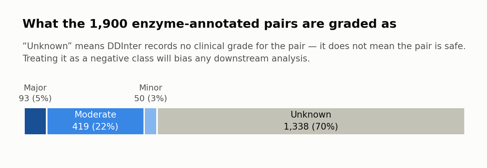
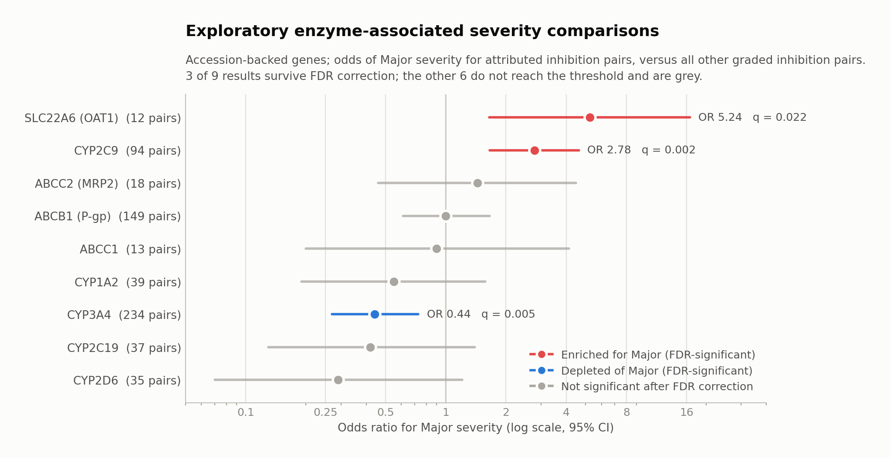
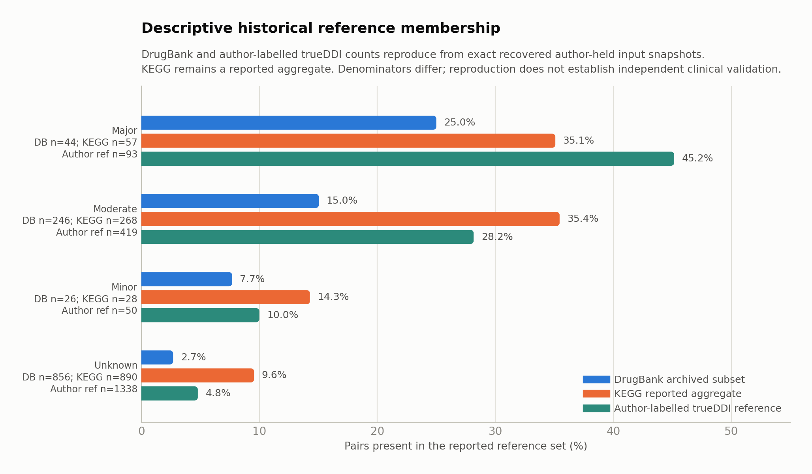

# An enzyme-resolved dataset linking drug interaction mechanisms to clinical severity grades

Version **2.3.0**, dataset snapshot, 5 October 2026. Repository: <https://github.com/adeebnoor/ddi-enzyme-severity-resource>.

The released author-derived export contains **1,900 unique unordered drug pairs**, **240 drugs**, **35 source protein labels**, and **3,072 pair–protein–direction rows**. DDInter 2.0 grades are rebuilt locally from a user's own download; public files contain identifiers and aggregate statistics. This is a research resource, not a prescribing tool.

**Reproducibility boundary:** the public files, their structural consistency, local identifier-based severity reconstruction, and the exploratory per-enzyme calculations are verifiable. Original D3 Java and SPARQL queries recover the general Enzyme/transporter rule logic. Two complete historical graph candidates have been recovered and assessed. The first matches 2,256 of 3,072 deposited CID–UniProt–direction keys, with 816 missing and 1,675 additional keys within deposited pairs; the second yields no core keys. These results establish partial historical support, and complete graph-to-current-record reconstruction remains unestablished. GoldD3R is an exact author-held contextual export of the D3 work (original article DOI 10.1093/jamia/ocw128). This release therefore does **not** claim complete reconstruction from original source resources. Exact available file hashes and missing metadata are recorded in [sources/sources.csv](sources/sources.csv) and [workflow.yaml](workflow.yaml).

**Archive:** version 2.3.0 is published on Zenodo, DOI [10.5281/zenodo.23169653](https://doi.org/10.5281/zenodo.23169653) (concept DOI [10.5281/zenodo.23169652](https://doi.org/10.5281/zenodo.23169652) identifies the version series). This repository includes post-publication citation and licence-status documentation updates; the scientific files are unchanged. The development copy is not claimed to be byte-identical to the published ZIP; citation metadata is in [CITATION.cff](CITATION.cff).



## Release inventory

All CSV files are UTF-8 with one header row. Column definitions and caveats are in [data/DATA_DICTIONARY.md](data/DATA_DICTIONARY.md).

| File | Rows | Role |
| --- | ---: | --- |
| data/ddi_enzyme_database.csv | 1,900 | Primary pairs, identifiers, source protein labels and mechanism classes |
| data/enzyme_pair_attribution.csv | 3,072 | Long-format pair × protein label × direction |
| data/cid_severity_bridge.csv | 448 | Candidate PubChem–DDInter identifier bridge; 240 display names populated |
| data/cid_drugbank_crosswalk.csv | 255 | PubChem–DrugBank identifier-only bridge |
| data/severity_summary.csv | 5 | Aggregate expected grade counts, including total |
| data/enzyme_severity_stats.csv | 9 | Exploratory per-enzyme statistics |
| data/enzyme_severity_stats_single_enzyme.csv | 9 | Single-enzyme sensitivity statistics |
| data/drugbank_validation_summary.csv | 8 | DrugBank aggregate comparison; exact 16,316-pair author-archived input recovered |
| data/kegg_validation_summary.csv | 13 | Historical reported aggregate comparison |
| data/liddi_coverage_comparison.csv | 7 | Historical reported coverage comparison |
| data/protein_annotation_audit.csv | 35 | Current official accession-backed human gene audit; two raw symbol conflicts |
| data/reference_membership_aggregate.csv | 10 | Recovered trueDDI/DrugBank membership totals and per-grade counts |

[Tables 1–2 and supplementary tables S1–S3](tables/README.md) provide the release inventory, source boundaries, exploratory statistics, reported reference-membership counts. The workbook contains the same numeric records. Prior hypothesis tables are retired. Clinical-trial pair flags remain withdrawn. The correct original author attachment `data-trueDDI-new.txt` (dated correspondence 10 January 2019) now reproduces all 229 legacy trueDDI memberships exactly; the smaller user-supplied candidate file was a different snapshot. Public pair flags are still excluded. The selected-only phenotype layer, S4 and its figure are withdrawn entirely because a full enzyme test family could not be recovered.

## Local use and validation

```bash
python3 validate.py
sha256sum -c CHECKSUMS.sha256
python3 scripts/rebuild_protein_audit.py  # offline, frozen official identity snapshot
python3 scripts/rebuild_primary_snapshot.py
python3 scripts/test_primary_reconstruction.py

# Acquire your own DDInter 2.0 CSVs under its source terms:
python3 scripts/rebuild_severity.py path/to/ddinter_downloads/
python3 validate.py
python3 pipeline/enzyme_severity_stats.py

# From exact authorised author-held archived reference files (raw files are not deposited):
python3 scripts/rebuild_reference_membership.py trueDDI /local/data-trueDDI-new.txt --grades data/derived/ddi_enzyme_database_with_severity.csv
python3 scripts/rebuild_reference_membership.py DrugBank /local/01-16-HardProvenDDI-DrugBank.txt --grades data/derived/ddi_enzyme_database_with_severity.csv
python3 scripts/test_reference_parser.py
python3 examples/quickstart.py
```

`validate.py`, `rebuild_primary_snapshot.py`, `rebuild_severity.py` and `rebuild_reference_membership.py` use the Python standard library. Statistics require SciPy; figures require Matplotlib; the workbook requires openpyxl; examples require pandas. The reconstruction environment is recorded in `requirements-review.txt`. Locally rebuilt grades go to ignored `data/derived/` and are excluded from public releases.

`scripts/rebuild_primary_snapshot.py` groups the deposited long-format rows by canonical unordered numerical CID pair, aggregates unique preserved raw protein labels and historical mechanism classes, and takes display names and DDInter identifiers from `cid_severity_bridge.csv`. It reconstructs all **1,900 primary record contents** from the **3,072 attribution rows** and verifies semantic equality against every column of the deposited primary table. Its output is sorted by CID pair in ignored `data/derived/`; the historical primary CSV row order is not reproduced. This is a downstream snapshot transformation, not reconstruction of the original selection from the reported 20,618-pair upstream superset. The original bundle already contains 1,900 rows at its first upload; that earlier selection remains unrecovered. The historical manuscript describes its intended criterion as compound-name normalisation followed by DDInter matching: 313 of 448 candidate CIDs joined, retaining pairs with a DDInter record. The current bridge verifies 313 joined and 135 unjoined candidate CIDs, and the retained table uses 240 CIDs. These checks document the stated criterion and resulting snapshot; the upstream pair inclusion/exclusion records are unavailable.

The join treats DDInter drug identifiers as unordered pairs, considers all combinations of multiple identifiers, and keeps the maximum matched grade under **Minor < Unknown < Moderate < Major**. Missing source pairs become `NotFound`. The expected joined output is **93 Major, 419 Moderate, 50 Minor and 1,338 Unknown**. Its SHA-256 fingerprint is `aa59130abacc7ef80249c419bc693b9d417d91d2dfc489ff25adf17fb2fc7609`. A match verifies this output column; it does not establish the original full DDInter download version or reproduce missing enzyme-detail inputs.

Open `docs/index.html` locally to search drugs, filter exact source protein labels, sort, and export filtered CSVs. Separate filters select accession-backed human genes and preserved raw source labels. The HTML is self-contained. You can load DDInter CSVs in the browser; no files or grades are uploaded. The browser checks the same joined-grade fingerprint where the browser cryptography API is available. `scripts/make_browser.py` regenerates its embedded records from the primary public CSV.

## Descriptive coverage and exploratory reuse



`Unknown` is missing clinical grading in the matched source, not evidence of absence or safety. `NotFound` is distinct: the local download has no matching DDInter row. Neither belongs in a negative supervised-learning class.



The calculation uses unique unordered pairs with a Major, Moderate or Minor grade and at least one inhibition-direction attribution (549 pairs). For each gene symbol, its exposed arm contains pairs with inhibition attribution to that symbol; its disjoint comparator contains all other included pairs. Multi-enzyme pairs enter each relevant enzyme's exposed arm. Protein identity is grouped by the frozen official UniProt accession audit, not by raw label stripping. All 35 source accessions resolve to reviewed human genes; unresolved annotations would be excluded (none in this snapshot). Nine genes have at least 10 included pairs. Two-sided Fisher tests, Woolf 95% intervals with +0.5 only for zero cells, and Benjamini–Hochberg adjustment across nine tests are implemented in `pipeline/enzyme_severity_stats.py`. The sensitivity set contains 424 pairs with only one inhibition-attributed symbol.

CYP2C9 (OR 2.78, *q* = 0.002), CYP3A4 (OR 0.44, *q* = 0.005) and **SLC22A6/OAT1** (OR 5.24, 95% CI 1.65–16.64, *q* = 0.022; 6 Major among 12 graded pairs) reach the predefined FDR threshold. The other six rows do not. The prior OATP1B1 biological estimate is withdrawn: its historical source-label grouping combined two distinct accessions. True SLCO1B1 has only two graded pairs and fails the minimum-10 eligibility threshold. These comparisons illustrate reuse and are not causal enzyme-specific clinical risk estimates. All 12 graded SLC22A6/OAT1 exposed pairs contain methotrexate (CID 4112); the single-gene sensitivity analysis retains the same 12 pairs. Excluding methotrexate leaves no OAT1 exposed pairs. This estimate therefore describes a methotrexate-centred subset association, and a general or drug-adjusted OAT1 effect is not identifiable from this snapshot. E-values have been removed.



The recovered author-held DrugBank subset has 16,316 unique unordered pairs; the public identifier crosswalk yields 1,172 testable pairs and 73 matching pairs (11 Major, 37 Moderate, 2 Minor, 23 Unknown), exactly reproducing the historical membership set. The correct recovered author-labelled trueDDI file has 40,631 rows and 30,743 unique unordered pairs under its explicit encoded-CID convention; it reproduces all 229 historical memberships (42 Major, 118 Moderate, 5 Minor, 64 Unknown). These are **descriptive reference-membership comparisons**, not proof of independent clinical validation. The archived correspondence dates identify known copies; original provider releases, export creation dates, extraction procedures and permissions remain unresolved.

Exact reference filenames and SHA-256 values are in [sources/recovered_reference_sources.csv](sources/recovered_reference_sources.csv). Authorised users can reproduce aggregate counts with `scripts/rebuild_reference_membership.py`, which rejects different raw snapshots and writes **aggregate CSV and JSON audit only**. It never exports pair flags or raw source content. Per-grade aggregation requires the reference DDInter joined-grade fingerprint. Seven parser, hash, reversal/deduplication and missing-crosswalk checks are in `scripts/test_reference_parser.py`.

KEGG remains a historical reported aggregate because its exact input snapshot and extraction workflow have not been recovered. Its Major (35.1%) and Moderate (35.4%) rates are similar. Every series in Figure 4 uses its own grade-specific denominator.

The phenotype layer has been withdrawn from the public data, tables and figures. The old selected 434 *q* values are internally consistent with a BH family of 3,865, but the omitted tests, complete enzyme observation matrix and exact generation inputs are unavailable. Recovered 2017 broad-mechanism HPO matrices belong to a separate analysis branch; they do not contain enzyme identities or the complete current HPO universe and cannot substitute for it.

## Recovered D3 mechanism logic

D3 enzyme queries match a protein typed **Enzyme** when one drug has `drug_is_metabolized_by_enzyme`, `substrate_of` **or `has_target`**, and the other drug `inhibits` or `induces` the same protein. Transporter queries use `drug_is_transported_by` plus `inhibits`/`induces` and protein type **Transporter**. The Java methods query both drug orders. This explains why shared-target annotations occur. The historical CSV labels `CYP inhibition` / `CYP induction` are retained for compatibility, but they include **general Enzyme** annotations and must not be treated as exclusively CYP-mediated pharmacokinetic mechanisms. Source rules are recovered; neither assessed historical graph reproduces the exact current record. Sanitized aggregate comparisons and the private archives’ file-hash identities are in [sources/historical_graph_audit_summary.json](sources/historical_graph_audit_summary.json). Raw graphs, mappings, private keys and legacy configuration remain excluded.

## Identifier and attribution caveats

- Join long-format rows on CIDs, not drug names: 32 long-table names differ from cleaned display names.
- Sixteen candidate CIDs carry multiple DDInter identifiers. Preserve the explicit max-grade join rule.
- Raw `SLCO1B1 (OATP1B1)` is attached to `Q4U2R8`, whose official primary gene is **SLC22A6/OAT1**; raw `SLCO1B3? (OATP)` is attached to `Q8TCC7`, which resolves to **SLC22A8/OAT3**. Bare `SLCO1B1` uses `Q9Y6L6` and is correctly identified. Raw labels are preserved; statistics and the official-gene browser filter use verified accession-backed identities.
- [data/protein_annotation_audit.csv](data/protein_annotation_audit.csv) documents all 35 current primary accessions, reviewed Homo sapiens status, retrieval date 5 October 2026 and UniProt release 2026_03. Thirty-three raw symbols agree and two conflict. This audit resolves protein identity; it does not independently verify the pair-level mechanism.
- Shared-target or atypical labels occur: 26 primary pairs contain only labels in an analyst-defined screening set; this does not validate the underlying mechanism. Prodrug–metabolite pairs and combination-product or brand names also occur. Benchmark users should define exclusions explicitly.

## Rights and source terms

MIT applies to author-written code. CC BY 4.0 applies to the author's original documentation, figures and contribution to derived tables **to the extent the author owns those rights**. It does not override third-party terms or certify missing upstream permissions. Whole-core redistribution permission for the historical enzyme-attribution snapshot has not been independently established. The component grants do not establish that permission, and no retrospective source licence is inferred from D3 authorship or current database terms. Consult [LICENSE](LICENSE) and the source manifest before redistribution or commercial reuse. A request for clarification of the applicable historical DrugBank terms and redistribution permission has been sent to DrugBank. The response is pending; no new permission is asserted.

DDInter clinical grades are excluded from the public CSVs and browser; use your own authorised download under DDInter's terms. Raw DrugBank/trueDDI reference files and membership flags, and raw KEGG/MIMIC validation exports, are excluded; this does not establish rights for the source-derived core annotations. Private historical exports, raw reference material and local derived grades must not be included in GitHub or Zenodo release files.

Questions and corrections: [repository issues](https://github.com/adeebnoor/ddi-enzyme-severity-resource/issues).
